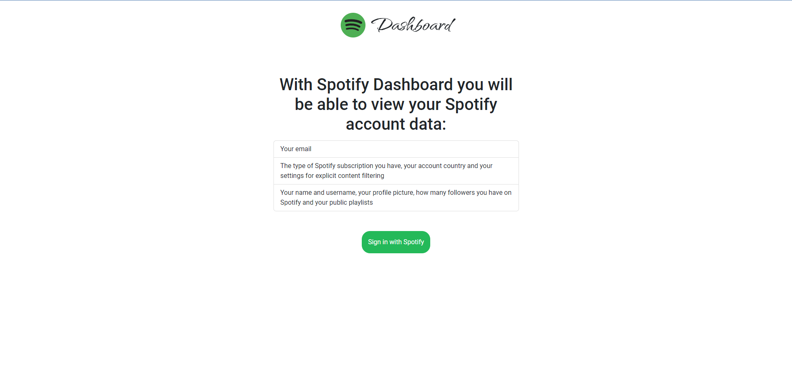

[![Contributors][contributors-shield]][contributors-url]
[![Forks][forks-shield]][forks-url]
[![Stargazers][stars-shield]][stars-url]
[![Issues][issues-shield]][issues-url]
[![MIT License][license-shield]][license-url]
[![LinkedIn][linkedin-shield]][linkedin-url]

<!-- PROJECT LOGO -->
 

  

<h3 align="center">Spotify Dashboard</h3>

  

    Look at your personal information on Spotify
     
    <a href="https://artyom-voitas.github.io/spotify-dashboard"><strong>View Demo</strong></a>
     
     
    <a href="https://github.com/artyom-voitas/spotify-dashboard/issues">Report Bug</a>
    ·
    <a href="https://github.com/artyom-voitas/spotify-dashboard/issues">Request Feature</a>
  

<!-- ABOUT THE PROJECT -->

## About The Project

  

This application is built on the Spotify API. With it, you can:

* look at your personal information
* go to the data editing page

### Built With

* [![React][React.js]][React-url]
* [![Redux][Redux.js]][Redux-url]
* [![Bootstrap][Bootstrap.com]][Bootstrap-url]
* [![Spotify][Spotify.com]][Spotify-url]

<!-- CONTACT -->

## Contact

Artsiom Voitas - [@artyom_voitas](https://twitter.com/artyom_voitas) - artsiom.voitas@gmail.com

Project Link: [https://github.com/artyom-voitas/spotify-dashboard](https://github.com/artyom-voitas/spotify-dashboard)

<!-- MARKDOWN LINKS & IMAGES -->
<!-- https://www.markdownguide.org/basic-syntax/#reference-style-links -->

[contributors-shield]: https://img.shields.io/github/contributors/artyom-voitas/spotify-dashboard.svg?style=for-the-badge

[contributors-url]: https://github.com/artyom-voitas/spotify-dashboard/graphs/contributors

[forks-shield]: https://img.shields.io/github/forks/artyom-voitas/spotify-dashboard.svg?style=for-the-badge

[forks-url]: https://github.com/artyom-voitas/spotify-dashboard/network/members

[stars-shield]: https://img.shields.io/github/stars/artyom-voitas/spotify-dashboard.svg?style=for-the-badge

[stars-url]: https://github.com/artyom-voitas/spotify-dashboard/stargazers

[issues-shield]: https://img.shields.io/github/issues/artyom-voitas/spotify-dashboard.svg?style=for-the-badge

[issues-url]: https://github.com/artyom-voitas/spotify-dashboard/issues

[license-shield]: https://img.shields.io/github/license/artyom-voitas/spotify-dashboard.svg?style=for-the-badge

[license-url]: https://github.com/artyom-voitas/spotify-dashboard/blob/master/LICENSE

[linkedin-shield]: https://img.shields.io/badge/-LinkedIn-black.svg?style=for-the-badge&logo=linkedin&colorB=555

[linkedin-url]: https://www.linkedin.com/in/artyom-voitas/

[React.js]: https://img.shields.io/badge/React-20232A?style=for-the-badge&logo=react&logoColor=61DAFB

[React-url]: https://reactjs.org/

[Bootstrap.com]: https://img.shields.io/badge/Bootstrap-563D7C?style=for-the-badge&logo=bootstrap&logoColor=white

[Bootstrap-url]: https://getbootstrap.com

[Spotify.com]: https://img.shields.io/badge/Spotify-1ED760?style=for-the-badge&logo=spotify&logoColor=white

[Spotify-url]: https://developer.spotify.com/

[Redux.js]: https://img.shields.io/badge/redux-%23593d88.svg?style=for-the-badge&logo=redux&logoColor=white

[Redux-url]: https://redux.js.org
